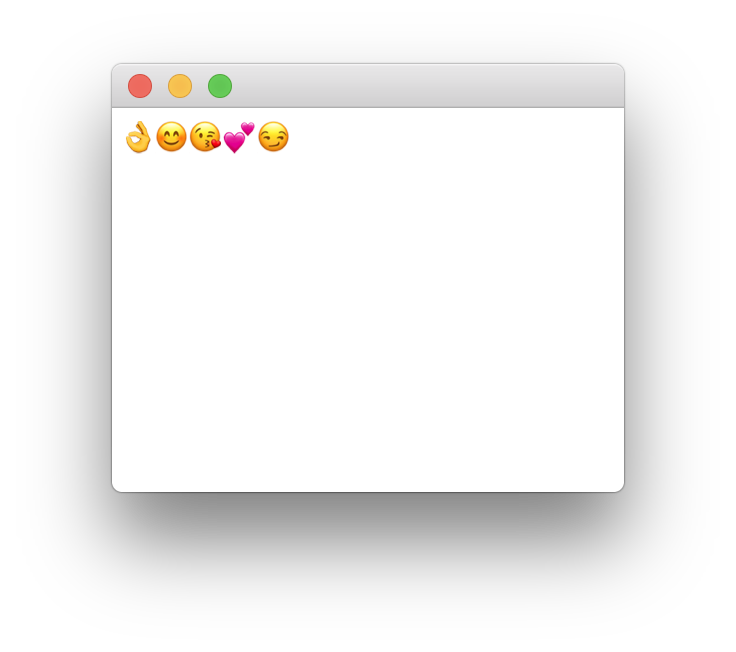

# Qt Touch Bar

This example shows how to create a global touch bar with standard
and custom items for a Qt-based application.

A touch bar capture:

The application screenshot:

# Qt version

This code sample was tested with the following *Qt* versions:

- 5.6.3

